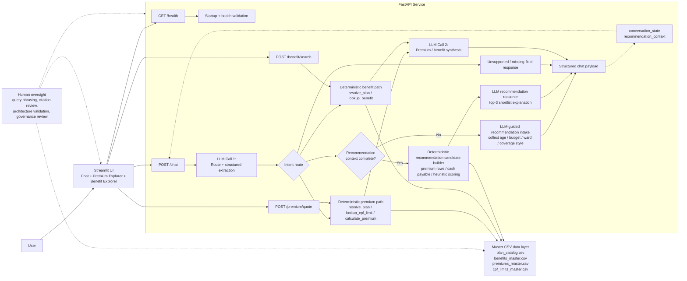

# Singapore Health Policy Navigator Architecture

## Human-in-the-loop checkpoints
- User reviews citations shown in chat and explorer tabs before relying on the answer.
- User provides recommendation preferences during in-chat intake before the shortlist is produced.
- Developer validates normalized data outputs, recommendation behavior, and smoke tests before submission.
- Report writer documents governance, risks, and economic value assumptions outside the runtime flow.
