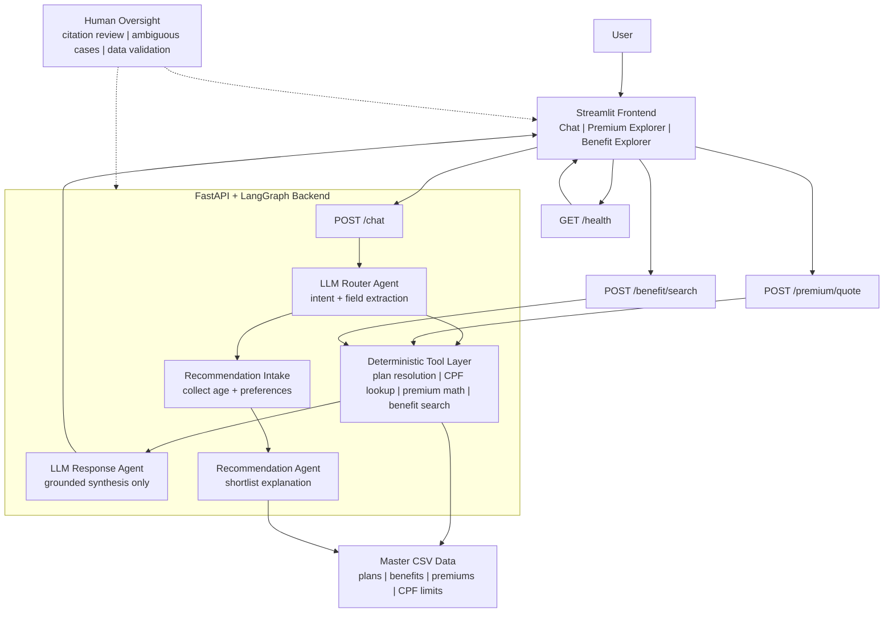
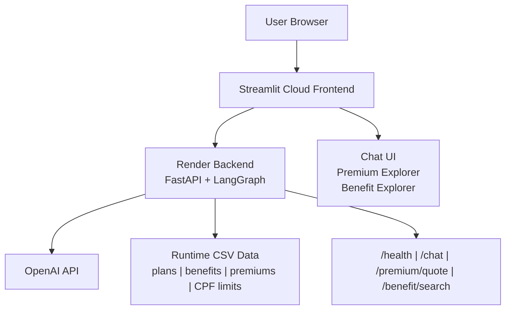
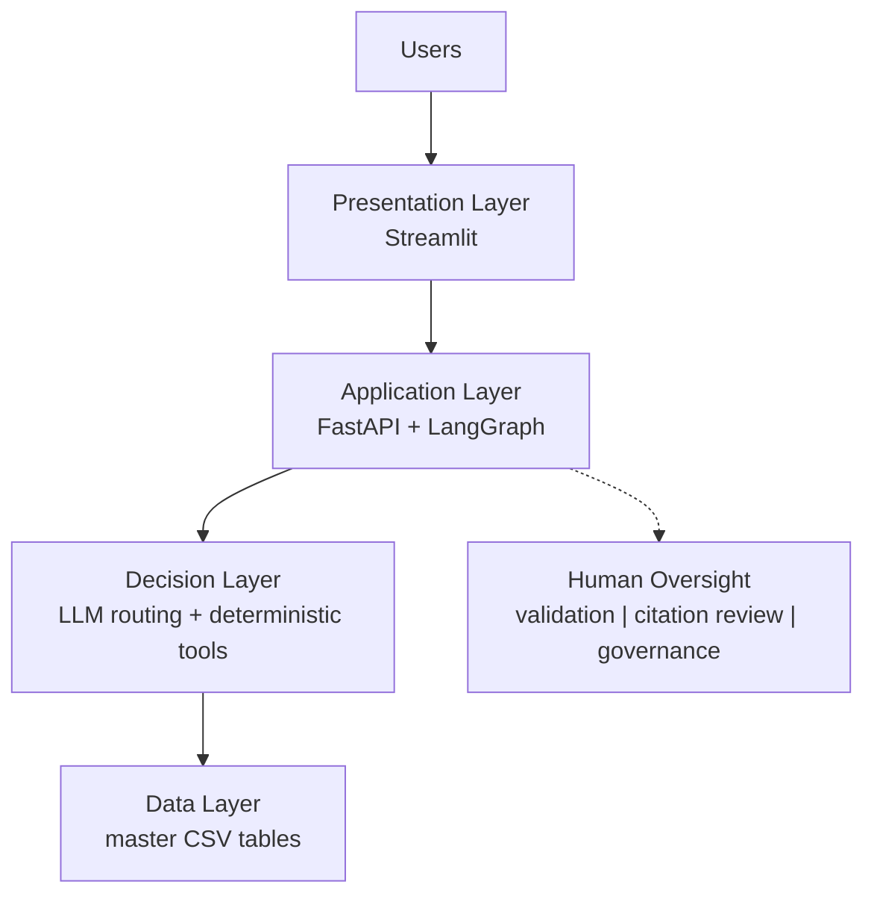

# Singapore Health Policy Navigator Architecture

## Compact Report Diagram

## Human-in-the-loop checkpoints
- User reviews citations before relying on an answer.
- User provides recommendation preferences during chat intake.
- Developer validates data normalization and smoke-test results before submission.

## Deployment Diagram

## High-Level Architecture Diagram

## Which one to use
- `Compact Report Diagram`: best if you want to explain agent flow and recommendation handling.
- `Deployment Diagram`: best if you want to show Streamlit, Render, and OpenAI clearly.
- `High-Level Architecture Diagram`: best if you want a clean one-figure summary in the main report.

## Report tip
- For the smallest Word-friendly version, paste only the Mermaid diagram and omit the bullets below it.
